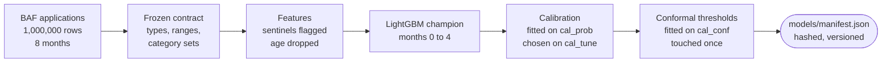
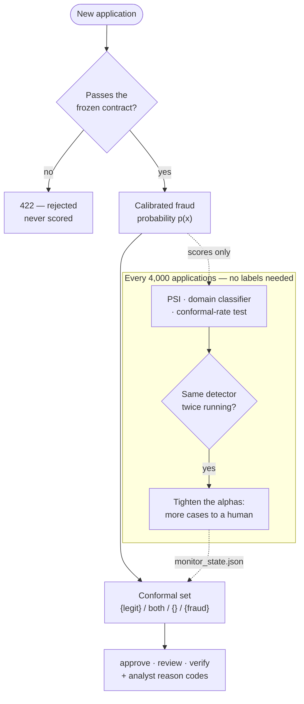
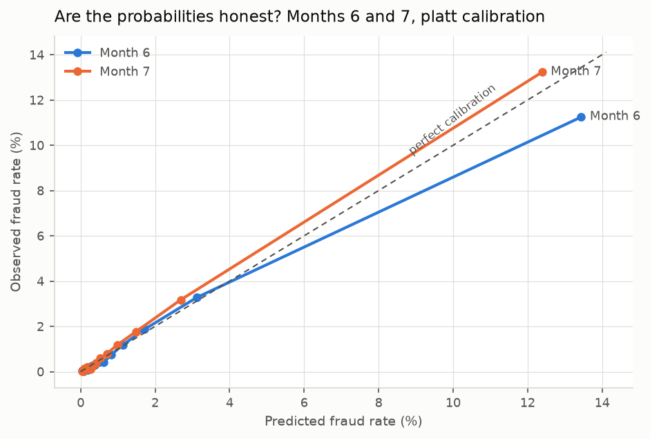
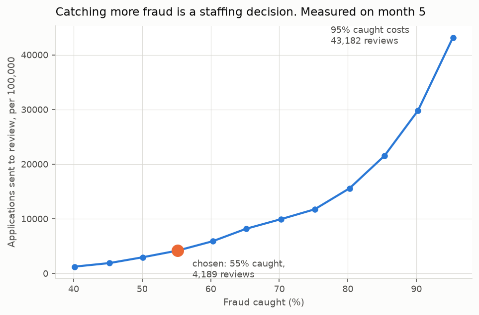
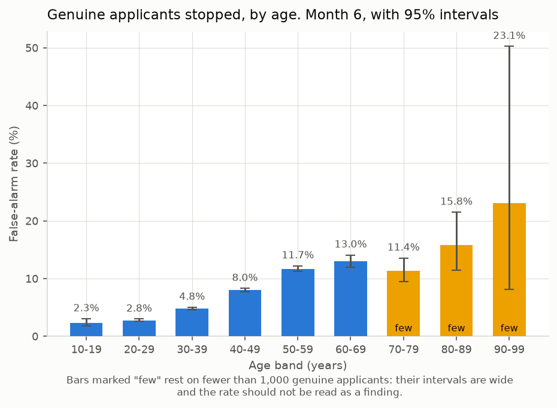
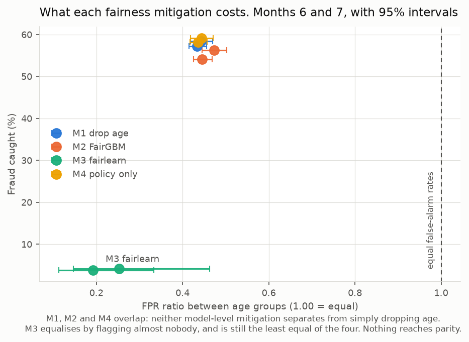

# Onboarding fraud triage

Scores an online bank-account application for fraud and routes it to one of three
outcomes: **approve**, **human review**, or **extra verification** — with a stated,
tested guarantee on how much fraud can slip through.

> **Status: complete and running.** Baselines, champion, calibration, conformal
> policy, fairness mitigations, drift monitor, scoring service and validation
> report all run end to end on the full million applications. Nothing below is
> typed by hand: every table is generated from `reports/metrics.json` by
> `make report`, and a run on sampled data refuses to write one.

---

## Why it matters

Opening an account is where a fraud problem usually starts, and the UK cost of
what follows is public:

- **APP scam losses were £576.4m in 2025**, up 19%, across 248,070 cases —
  [UK Finance, Annual Fraud Report 2026](https://www.ukfinance.org.uk/news-and-insight/press-release/fraud-report-2026-press-release).
- Since **7 October 2024**, victims can be reimbursed up to **£85,000**, with the
  cost split 50:50 between the sending and receiving firms —
  [summary](https://www.hlc.com/en/publications/uk-app-fraud-what-in-scope-psps-need-to-know-about-the-new-mandatory-reimbursement-regime).
- A model like this sits inside a model-risk framework:
  [PRA SS1/23](https://www.bankofengland.co.uk/prudential-regulation/publication/2023/may/model-risk-management-principles-for-banks-ss),
  in force since 17 May 2024.
- Automated decisions carry safeguards under the Data (Use and Access) Act, in
  force since 5 February 2026 —
  [summary](https://www.cliffordchance.com/insights/resources/blogs/talking-tech/en/articles/2026/02/key-aspects-of-the-data--use-and-access--act-take-effect.html).

So the interesting question is not "what is the AUC". It is: *how much fraud does
this catch, how many honest applicants does it inconvenience, can a real team
handle the workload, and does it fail safely when the data changes?*

---

## How it works

### What gets built, once

Everything the system knows is learned from months 0 to 5, and frozen:



Each artefact is hashed into a manifest. The service verifies those hashes at
startup and **refuses to serve on a mismatch** — a model nobody can identify is
worse than no model, because every claim in the validation report is attached to
that manifest.

### What happens to an application



Three things are worth noticing in that picture. Validation happens **before**
scoring, so a broken feed cannot reach the model. The monitor reads **scores, not
outcomes**, so it works weeks before any fraud label exists. And its only lever is
to send *more* work to humans — never to decide anything itself.

### Step one — does the application even make sense?

Before anything is scored, it is validated against a **contract frozen from the
first verified load of the data**: types, ranges, category sets, and which
negative numbers mean "missing" rather than a real value. An application that
breaches it is rejected outright rather than scored.

This is not ceremony. The monitoring experiments inject an upstream fault that
multiplies income by ten, and the contract stops it at the door — it never reaches
a detector, because it never reaches the model.

### Step two — score it, without looking at age

The champion is a LightGBM model trained on months 0 to 4. It never sees
`customer_age`. The API accepts age and logs it so fairness can be measured, then
drops it before the model sees anything.

That choice costs nothing detectable — the detection table below has the champion,
which never sees age, slightly *ahead* of B1, which does — so the information was
never uniquely in that column. Read it as "dropping age did not cost detection"
rather than as a controlled experiment: since the tuning pass the two models no
longer share hyper-parameters, because B1 keeps the published baseline's. Other
fields carry the same signal, which is exactly why "just drop the protected
attribute" is measured here rather than assumed to work.

The raw score is then **calibrated**, because the decision policy reads
probabilities rather than rankings. An uncalibrated gradient-boosted model can
rank applications beautifully and still be badly wrong about *how likely* fraud
actually is; the calibration table below shows exactly how wrong.

### Step three — turn a probability into a decision

This is the part that makes the project more than a classifier. Instead of one
threshold, there are two, and they produce a **set** of plausible labels:

```text
                       p(x) <= tau_legit ?        p(x) >= tau_fraud ?
                              |                          |
  application --> score --> {legit}                    {fraud}
                              |     \                  /     |
                              |      {legit, fraud} / {}     |
                              v            v                 v
                          APPROVE       REVIEW            VERIFY
                        (straight     (an analyst      (step-up checks
                         through)       looks)          or a human)
```

Read it as the model answering "which labels can I not rule out?"

- **Only "legit" survives** → nothing suggests fraud → approve.
- **Both survive** → the model cannot separate this case → a human looks at it.
- **Only "fraud" survives** → ask for more checks.
- **Neither survives** → the case looks unlike *anything* in calibration → also a
  human, because an empty set is a confession of ignorance, not a verdict.

There is **no automatic decline**. The strongest action available is a request for
further checks.

The two thresholds come from **label-conditional split conformal prediction**: a
way of setting thresholds so that a stated share of fraud is caught, *as long as
new applications look like the calibration data*. It offers two guarantees:

- at most `alpha_fraud` of fraud is ever auto-approved;
- at most `alpha_legit` of genuine applicants is sent for extra verification.

That italicised condition is doing real work, and this project takes it seriously
enough to test it. One of the two guarantees held on the test months and **one did
not** — see *What didn't work*.

### Why the data is split the way it is

Every number depends on this, so it is worth being precise. Splits are by **month
only** — never a random row split, which would let the model learn from its own
future.

```text
  month   0     1     2     3     4   |        5        |   6        7
        +-----------------------------+-----------------+------------------+
        |        TRAIN                |   CALIBRATION   |   TEST           |
        |  fits the model             |  split 3 ways   |  never touched   |
        +-----------------------------+-----------------+------------------+
                                       /       |       \
                           cal_prob   /    cal_tune     \   cal_conf
                        fits the         chooses the        sets the
                        calibrator       alphas and         conformal
                                         the threshold      thresholds
```

Month 5 is cut three ways for a reason that matters more than it looks. If the
same data chose the alphas *and* produced the thresholds, the coverage guarantee
would be a description of the past rather than a claim about the future.
**`cal_conf` is touched exactly once**, at the very end, and nothing else is
allowed to learn from it.

Months 6 and 7 are reported **separately**, never only pooled, because a model can
look stable on average while degrading month over month.

### Step four — notice when the world moves

The guarantees above hold while new applications resemble the calibration month.
The monitor's job is to notice when they stop, **without waiting for fraud labels**
— which in reality arrive weeks or months late, if at all.

Every 4,000 applications (one simulated day), three detectors run:

| Detector | The question it asks |
|---|---|
| **PSI**, on the score and each feature | has any single distribution shifted? |
| **Domain classifier** | can a small model tell this window from the reference *at all*? |
| **Conformal-rate test** | are the policy's own threshold-crossing rates still what calibration said? |

Thresholds are not guessed. Each is set at the 99th percentile of 200 windows
drawn from the calibration month — windows that are clean by construction — so the
false-alarm rate is a measured property rather than a hope.

A single window over threshold is a **watch**. The *same* detector over threshold
twice running is an **alert**, which is what separates a blip from a break. On
alert the policy switches to tighter alphas, sending more cases to a human, and
the service picks that up on its next request. It is never cleared automatically.

The most useful thing this monitor did was catch the guarantee breaking on month
6 using no labels at all — the same failure the conformal results show, detected
independently.

---

## Results

Every table below is generated by `make report` from `reports/metrics.json`. None
of it is typed by hand: if a number is missing, the artefact that produces it has
not been run.

### What the model is trained and tested on

<!-- metrics:data -->
| Split | Months | Applications | What it is for |
| --- | --- | --- | --- |
| Training | 0-4 | 675,666 | fits the model |
| `cal_prob` | 5 | 39,782 | fits probability calibration |
| `cal_tune` | 5 | 39,771 | chooses the alphas and the threshold |
| `cal_conf` | 5 | 39,770 | conformal thresholds only, no choices |
| Test | 6 | 108,168 | reported on its own |
| Test | 7 | 96,843 | reported on its own |
<!-- /metrics:data -->

### Detection

<!-- metrics:baselines -->
| Model | Protocol | Month | ROC-AUC | PR-AUC | TPR@0.05 FPR (95% CI) | Realised TPR | Realised FPR |
| --- | --- | --- | --- | --- | --- | --- | --- |
| `b0_logreg` | paper | 6 | 0.882 | 0.155 | 0.506 (0.482-0.534) | 0.534 | 0.0587 |
| `b0_logreg` | paper | 7 | 0.887 | 0.185 | 0.534 (0.506-0.56) | 0.479 | 0.0402 |
| `b0_logreg` | deployment | 6 | 0.881 | 0.153 | 0.502 (0.476-0.528) | 0.519 | 0.0548 |
| `b0_logreg` | deployment | 7 | 0.886 | 0.182 | 0.532 (0.502-0.56) | 0.439 | 0.033 |
| `b1_lgbm` | paper | 6 | 0.887 | 0.154 | 0.494 (0.47-0.521) | 0.504 | 0.0517 |
| `b1_lgbm` | paper | 7 | 0.888 | 0.179 | 0.548 (0.519-0.571) | 0.536 | 0.0481 |
| `b1_lgbm` | deployment | 6 | 0.887 | 0.159 | 0.512 (0.488-0.538) | 0.553 | 0.0619 |
| `b1_lgbm` | deployment | 7 | 0.89 | 0.187 | 0.553 (0.524-0.578) | 0.58 | 0.0567 |

The paper protocol sets its threshold **on the test set**, as the BAF paper does; it is optimistic by construction and exists only for comparison with published results. The deployment protocol sets its threshold on `cal_tune`, which is part of month 5, and never touches months 6 or 7.

Training data: 1,000,000 applications, 1.1% fraud. Confidence intervals: 1,000 stratified bootstrap resamples at the 95% level.
<!-- /metrics:baselines -->

### Probability calibration

<!-- metrics:calibration -->
| Method | Brier | ECE (15 equal-mass bins) | Mean predicted rate | Observed rate |
| --- | --- | --- | --- | --- |
| `isotonic` | 0.01046 | 0.00122 | 1.22% | 1.18% |
| `none` | 0.01048 | 0.0034 | 0.883% | 1.18% |
| `platt` **chosen** | 0.01044 | 0.00134 | 1.23% | 1.18% |

Fitted on `cal_prob` and chosen on `cal_tune`, two disjoint thirds of month 5, by brier score. The last two columns are calibration-in-the-large: an uncalibrated model can rank well and still be badly wrong about *how likely* fraud is, which matters here because the decision policy reads probabilities, not ranks.
<!-- /metrics:calibration -->



### Decision policy

<!-- metrics:policy -->
| Month | Fraud caught | Genuine sent to verify | Approve | Review | Verify |
| --- | --- | --- | --- | --- | --- |
| 6 | 0.581 | 0.016 | 0.925 | 0.055 | 0.0198 |
| 7 | 0.591 | 0.013 | 0.935 | 0.0478 | 0.0175 |

Policy: `alpha_fraud = 0.45`, `alpha_legit = 0.01`, chosen on `cal_tune` as the best fraud coverage the review team could absorb, then turned into thresholds on `cal_conf` — a third of month 5 that nothing else touches.

The promise is: catch at least **55%** of fraud, and send at most **1%** of genuine applicants for extra verification. The first half held on both test months. The second did not — see *What didn't work*. The capacity figures behind the choice are the owner's assumptions, not facts about the data.
<!-- /metrics:policy -->

#### What each level of fraud coverage costs

<!-- metrics:tradeoff -->
| Fraud caught | Review share | Verify share | Reviews per 100,000 applications |
| --- | --- | --- | --- |
| 40% | 0.0124 | 0.0132 | 1,242 |
| 45% | 0.019 | 0.0132 | 1,896 |
| 50% | 0.0296 | 0.0132 | 2,964 |
| 55% **chosen** | 0.0419 | 0.0132 | 4,189 |
| 60% | 0.059 | 0.0132 | 5,899 |
| 65% | 0.0818 | 0.0132 | 8,182 |
| 70% | 0.0994 | 0.0132 | 9,944 |
| 75% | 0.117 | 0.0132 | 11,735 |
| 80% | 0.156 | 0.0132 | 15,587 |
| 85% | 0.215 | 0.0132 | 21,543 |
| 90% | 0.298 | 0.0132 | 29,811 |
| 95% | 0.432 | 0.0132 | 43,182 |

Measured on `cal_tune`, at `alpha_legit = 0.01`. This is the whole curve, not just the point that was chosen, because the shape is the argument: the last few points of fraud coverage cost far more review capacity than the first. A 90% catch rate is not a modelling problem, it is a staffing one.
<!-- /metrics:tradeoff -->



#### Who carries the cost

<!-- metrics:coverage_by_age -->
| Age band | Applications | Frauds | Fraud caught | Sent to review | Sent to verify |
| --- | --- | --- | --- | --- | --- |
| 10-19 | 2,166 | 9 | (0.333) | 0.0231 | 0.00369 |
| 20-29 | 25,318 | 153 | 0.458 | 0.0253 | 0.00656 |
| 30-39 | 30,959 | 309 | 0.463 | 0.0414 | 0.0127 |
| 40-49 | 28,613 | 408 | 0.581 | 0.0676 | 0.0232 |
| 50-59 | 15,951 | 374 | 0.66 | 0.0939 | 0.041 |
| 60-69 | 3,963 | 146 | 0.705 | 0.106 | 0.0487 |
| 70-79 | 975 | 43 | 0.767 | 0.0923 | 0.0564 |
| 80-89 | 210 | 8 | (0.875) | 0.138 | 0.0476 |
| 90-99 | 13 | 0 | (n/a) | 0.154 | 0.0769 |

Month 6, under one age-blind pair of thresholds: the policy does not know anyone's age. A bracketed figure rests on fewer than 20 frauds and is noise.

Coverage rises with age and so does the workload: an older applicant is far more likely to be stopped for review or verification. Fixing this with age-specific thresholds would mean using age at decision time, which this project does not do (rule 4). It is recorded as a finding for the mitigation experiments instead.
<!-- /metrics:coverage_by_age -->



### Fairness

<!-- metrics:fairness -->
| Model | Month | FPR, under 50 | FPR, 50 and over | FPR ratio (95% CI) |
| --- | --- | --- | --- | --- |
| `b0_logreg` | 6 | 0.038 | 0.126 | 0.302 (0.289-0.317) |
| `b0_logreg` | 7 | 0.0246 | 0.0901 | 0.273 (0.255-0.295) |
| `b1_lgbm` | 6 | 0.0446 | 0.135 | 0.331 (0.316-0.346) |
| `b1_lgbm` | 7 | 0.0453 | 0.134 | 0.337 (0.32-0.356) |

Predictive equality: `min(FPR) / max(FPR)` across the two age groups, computed on genuine applicants only, at the threshold chosen on `cal_tune`. 1.0 is parity; lower is a wider gap. Age is used here to **measure** the model, never to decide anything.

Both baselines see `customer_age` as a feature. The champion does not, and the mitigation experiments M1-M4 test whether that is enough.
<!-- /metrics:fairness -->

<!-- metrics:age_bands -->
| Age band | Genuine applicants | False alarms | FPR | Note |
| --- | --- | --- | --- | --- |
| 10-19 | 2,157 | 38 | 0.0176 |  |
| 20-29 | 25,165 | 536 | 0.0213 |  |
| 30-39 | 30,650 | 1,298 | 0.0423 |  |
| 40-49 | 28,205 | 1,968 | 0.0698 |  |
| 50-59 | 15,577 | 1,916 | 0.123 |  |
| 60-69 | 3,817 | 658 | 0.172 |  |
| 70-79 | 932 | 141 | (0.151) | too few to read |
| 80-89 | 202 | 46 | (0.228) | too few to read |
| 90-99 | 13 | 5 | (0.385) | too few to read |

`b1_lgbm`, month 6, at the threshold chosen on `cal_tune`. The rate climbs steadily with age. A bracketed rate comes from fewer than 1,000 genuine applicants and is noise, not a finding: with a handful of people in a band, the confidence interval covers almost the whole range.

This is the gap the mitigation experiments (M1-M4) have to close, and the reason the champion never sees age.
<!-- /metrics:age_bands -->

#### What the mitigations bought

<!-- metrics:mitigations -->
| Mitigation | Month | Fraud caught | Genuine stopped | FPR ratio (95% CI) |
| --- | --- | --- | --- | --- |
| M1 — drop age | 6 | 0.572 | 0.065 | 0.433 (0.415-0.455) |
| M1 — drop age | 7 | 0.584 | 0.055 | 0.443 (0.418-0.47) |
| M2 — FairGBM, FPR constraint | 6 | 0.541 | 0.0616 | 0.445 (0.426-0.469) |
| M2 — FairGBM, FPR constraint | 7 | 0.563 | 0.0568 | 0.473 (0.446-0.503) |
| M3 — fairlearn, FPR parity | 6 | 0.0379 | 0.000525 | 0.192 (0.113-0.334) |
| M3 — fairlearn, FPR parity | 7 | 0.042 | 0.000597 | 0.252 (0.147-0.463) |
| M4 — policy only, no model change | 6 | 0.581 | 0.0679 | 0.436 (0.418-0.457) |
| M4 — policy only, no model change | 7 | 0.591 | 0.0573 | 0.444 (0.419-0.47) |

All four use age at training or measurement time only; none uses it to decide anything about an application. M1 and M2 are thresholded at 5% FPR on `cal_tune`. M3 is a randomised classifier with a single operating point, so it is measured where it sits rather than swept. M4 changes no model at all: an application counts as stopped if the conformal policy sends it to review or verify.

The two model-level mitigations did not earn their place. Read the M3 row carefully: at roughly 1% prevalence, the cheapest way to equalise false-positive rates between groups is to stop flagging anyone, and that is close to what it did — while still ending up the least equal of the four.
<!-- /metrics:mitigations -->



### Monitoring

<!-- metrics:monitoring -->
| Injected fault | Legal under the contract? | Caught by | How long it ran | Detection cost |
| --- | --- | --- | --- | --- |
| Mobile check always passes | yes | monitor | 1 window (4,000 applications) | -0.6 pts |
| Income multiplied by ten | **no** | contract | before scoring | never scored |
| Income scale reversed | yes | monitor | 1 window (4,000 applications) | -6.8 pts |
| Two employment codes swapped | yes | monitor | 1 window (4,000 applications) | -9.8 pts |

**False alarms.** Across 200 windows drawn from the calibration month — clean by construction — 6 raised a watch (3.0%) and 0 an alert. For four detectors at a 99th-percentile threshold the expected watch rate is 3.9%, so the false-alarm rate is a measured property rather than a hope.

**Detection.** The three faults that are *legal* under the contract are the ones worth catching, because no schema check can see them: the values stay in range and only their meaning changes. Each reached an alert one window after injection, which is the floor the two-consecutive-windows rule allows. The fourth is the control — the contract rejects it before anything is scored.

Delays are measured on a stream drawn from the calibration month, which is quiet without a fault. Section 8.5 injects into month 6, but month 6 is already alerting on its own drift (50 of 51 windows), so a delay measured there could not be attributed to the fault. Both experiments are in `reports/monitoring.json`.

**Natural drift is not a false alarm.** Months 6 and 7 really did move, and the monitor saying so is it working. That same movement is why one half of the conformal guarantee failed.
<!-- /metrics:monitoring -->

### Service

<!-- metrics:service -->
| Path | p50 (ms) | p95 (ms) | p99 (ms) | Under 15 ms? |
| --- | --- | --- | --- | --- |
| Scoring only, no reason codes | 5.42 | 7.78 | 9.66 | yes |
| Scoring only, with reason codes | 152.29 | 242.24 | 260.78 | **no** |
| Full HTTP request, no reason codes | 6.42 | 7.99 | 8.90 | yes |
| Full HTTP request, with reason codes | 148.84 | 240.22 | 255.83 | **no** |

2,000 sequential requests after 100 warm-up, on CPU, single process, no network.

Reason codes dominate: they cost roughly twenty times the entire latency budget, because a SHAP explanation walks every tree for every request. Scoring itself is comfortably inside target, and the HTTP layer — validating the request against the frozen contract, then serialising — adds under two milliseconds. A caller that does not need an explanation should pass `?explain=false`; a queue that does should compute them out of band.

Docker image: 767 MB compressed, 3.35GB unpacked.
<!-- /metrics:service -->

---

## What didn't work

Failed experiments are kept here, never deleted to tidy the story. Every number
referred to below is in the generated tables above.

**1. Gradient boosting barely beat logistic regression.** The expected story was
that LightGBM would comfortably outperform a linear baseline. It does not: on
month 6 the two are separated by about one point of TPR at a 5% false-positive
rate, and their confidence intervals overlap heavily. On this dataset the signal
is mostly linear and available to both. The complexity has to earn its place
elsewhere — in calibration, in the decision policy, or not at all.

**2. A threshold chosen on month 5 does not hold on months 6 and 7.** Set at 5%
FPR on `cal_tune`, LightGBM realises noticeably more false positives than that on
both test months, and logistic regression undershoots badly on month 7. Nothing is
broken; the population simply moves. It is the clearest argument for the conformal
policy, which re-derives its thresholds from a held-out calibration set rather than
trusting one number to travel.

**3. Dropping age was never going to be enough on its own.** Before any mitigation
is tried, the false-alarm rate rises steadily across every age band. Other fields
carry the same information, which is exactly why M1 ("just drop age") is measured
rather than assumed, and why the fairness experiments exist at all. Removing the
column does move the FPR ratio in the right direction — 0.433 for the champion,
which never sees age, against 0.331 for B1, which does — but it lands nowhere near
parity, and it does so at almost no cost in detection. The information was never
really in that column. (The two models no longer share hyper-parameters, so that
gap is a comparison of two fitted models, not a controlled ablation.)

**4. Half of the conformal guarantee did not survive contact with months 6 and 7.**
The fraud side held: more fraud was caught than promised, on both test months. The
genuine side did not — more honest applicants were sent for extra verification
than the policy promised, on both months. That is not a bug in the arithmetic; it
is the exchangeability assumption failing. The thresholds were derived from month
5, and months 6 and 7 are not month 5: fraud is more common in them and the score
distribution has moved. This is the single strongest argument for the drift
monitor, and it is why the guarantee is always stated with its condition attached.

**5. Coverage over-delivered, which is not the same as being right.** Fraud
coverage came in several points above target, not within the ±1.5 points the plan
called for. Over-delivery is the safe direction, but it means the thresholds are
looser than intended, and the reason is visible in the data: `cal_conf` contains
only a few hundred frauds, so the threshold is an order statistic drawn from a
small sample. A bigger calibration month, or a different split of month 5, would
tighten it — at the cost of whatever that month is taken from.

**6. Tuning bought about a point, and 29 of 30 trials bought nothing.** The
hyper-parameter search ran with the hand-set parameters scored alongside it, so
it could be seen to win or lose. It won — 0.5785 against 0.5661 on the
validation month — but only one trial in thirty beat the starting point, and the
gap is inside the standard error of a single month's 1,452 frauds. The winner
was taken because both held-out months moved the same way, not because one
validation month settled it. Every trial is in
[`reports/tables/tuning_trials.csv`](reports/tables/tuning_trials.csv) so the
spread can be judged rather than taken on trust.

---

## What this does not show

- **The data is synthetic.** BAF was generated from an unnamed bank's
  applications. It is not UK data and it is not real customers.
- **No vulnerability analysis.** The dataset carries no vulnerability labels, so
  nothing here says anything about vulnerable customers.
- **Age is used to measure, never to decide.** The scoring model never sees
  `customer_age`. Age appears only in fairness measurement and, in two
  experiments, as a training-time constraint.
- **The guarantees assume exchangeability.** Coverage holds only while new
  applications look like the calibration data. That is exactly what the monitor
  watches for.
- **The costs are illustrative parameters**, not a saving. No "£ saved" figure is
  claimed anywhere.
- **This is a portfolio project.** It is not a production deployment, and it makes
  no claim about any named bank.

---

## How to run

Python 3.11 and [uv](https://docs.astral.sh/uv/). The Makefile assumes a POSIX
shell, so on Windows use WSL2 or the Docker image.

```bash
make setup      # uv sync + pre-commit hooks
make data       # needs Kaggle credentials; writes data/interim/*.parquet
make all        # data -> contract -> evaluate -> report -> bench -> test
```

Useful targets: `make test` (fast, needs no data), `make lint`, `make coverage`,
`make serve` (API on :8000), `make demo` (Streamlit), `make docker`. Run
`make help` for the full list.

`make coverage` gates the four packages where a silent mistake would be worst —
the conformal guarantee, the fairness metrics, the detectors and the decision
rule — at 85%. They currently sit at 95%. CI runs it on every push, because a
coverage target nothing enforces is one nobody has to meet.

While developing, pass `ARGS="data.sample_frac=0.1"`. Never report a number from a
sampled run — and you cannot: writing a reported section from a sampled run raises.

Every stage also logs to MLflow, in a local file store under `mlruns/` (`mlflow
ui` to browse). That is the *history* — every run, including the ones that were
wrong — and it is git-ignored. `reports/metrics.json` is the *current* state, it
is committed, and it is the only thing any document reads.

Hyper-parameter search is off by default, because an ordinary `make train` should
be one fit. `make train ARGS="model.tuning.enabled=true"` runs 30 seeded random
trials on months 0–3, scored on month 4, with the configured parameters included
as a baseline so the search can be seen to win or lose.

---

## How the code is organised

The shape follows the pipeline: each stage is a thin Hydra app over a library that
holds the actual logic, so everything interesting is importable and tested rather
than buried in a script.

```
src/triage/
├── data/          load.py        download, checksum, convert to parquet
│                  contract.py    the FROZEN schema; rejects bad input
│                  split.py       time-based splits and simulated days
├── features/      sentinels.py   negative values -> explicit missing flags
│                  encode.py      one-hot / categories; age dropped here
├── models/        baselines.py   B0 logistic regression, B1 LightGBM
│                  champion.py    the deployed model + hashed manifest
│                  calibrate.py   none / Platt / isotonic
│                  fair.py        M2 FairGBM, M3 fairlearn
├── uncertainty/   conformal.py   label-conditional split conformal, from scratch
├── policy/        decide.py      conformal set -> approve / review / verify
│                  sweep.py       the alpha grid and capacity selection
│                  cost.py        illustrative cost frame
├── fairness/      metrics.py     FPR ratio, age bands, relative likelihood
│                  bootstrap.py   stratified percentile intervals
├── monitoring/    psi.py/.sql    PSI in DuckDB, mirrored in pandas
│                  domain_clf.py  the "can you tell these apart?" detector
│                  conformal_rate.py  binomial test on crossing rates
│                  alarms.py      watch / alert rules
│                  fallback.py    the state the API reads
├── explain/       reasons.py     SHAP on the uncalibrated margin
├── evaluation/    metrics.py     every metric definition, in one place
│                  protocols.py   the two evaluation protocols
│                  artefacts.py   writes reports/metrics.json
│                  tables.py      README tables
│                  figures.py     the four figures
│                  validation.py  the validation report
│                  model_card.py  the model card
├── api/           app.py         FastAPI: /score, /health, /version, /monitor
│                  schemas.py     request model GENERATED from the contract
│                  service.py     artefact loading with hash verification
├── tracking.py    MLflow: the run history, alongside reports/metrics.json
└── stages/        one per make target
```

### Where the guarantees live

If you only read four files, read these:

| File | Why it matters |
|---|---|
| [`uncertainty/conformal.py`](src/triage/uncertainty/conformal.py) | The guarantee itself. Written from scratch, because the off-the-shelf version is marginal and collapses at 1% prevalence |
| [`data/contract.py`](src/triage/data/contract.py) | What "valid" means, frozen from the first verified load, and the reason a bad feed cannot reach the model |
| [`data/split.py`](src/triage/data/split.py) | The three-way cut of month 5 that makes the guarantee a claim about the future rather than the past |
| [`evaluation/artefacts.py`](src/triage/evaluation/artefacts.py) | Why no number in this README was typed by hand |

### How a result gets here

```text
  make baseline ─┐
  make train    ─┤
  make conformal├─>  reports/metrics.json  ──>  make report ──┬─> README tables
  make fairness ─┤                                            ├─> figures
  make monitor  ─┤                                            ├─> validation report
  make bench    ─┘                                            └─> model card
```

Stages write artefacts; `make report` renders them. Nothing else may put a number
in the README, which is why a stale result is visible rather than plausible.

---

## Repo map

| Path | What's in it |
|---|---|
| `configs/` | Hydra config: data, features, models, calibration, policy, monitor |
| `src/triage/` | The library, laid out above |
| `experiments/` | Variant stress tests, injected data bugs |
| `tests/` | 315 tests; 306 of them need no data, thanks to a seeded BAF-shaped fixture |
| `reports/` | Generated artefacts, the validation report, the model card, figures |
| `docs/` | Session notes and every design decision, as context → decision → consequences |
| `app/demo.py` | One-screen Streamlit demo, reading only precomputed artefacts |
| `docker/` | The service image |

---

## Validation report

[`reports/validation_report.md`](reports/validation_report.md) — a two-page
validation write-up in the style of a UK bank model validation (PRA SS1/23), with
the findings rated High, Medium or Low. The model card is at
[`reports/model_card.md`](reports/model_card.md), and outside reviews are logged
in [`reports/reviews.md`](reports/reviews.md).

---

## Data licence

The BAF dataset is published on
[Kaggle](https://www.kaggle.com/datasets/sgpjesus/bank-account-fraud-dataset-neurips-2022)
by its authors ([paper](https://arxiv.org/abs/2211.13358),
[docs and datasheet](https://github.com/feedzai/bank-account-fraud)). Check the
licence on that page before redistributing anything derived from it. No data files
are committed to this repository.
